# 水仙的AI提示词 · Shuixian's AI Prompts

[简体中文](README.md) · **English**

> One merged site (modern / classic skins, switchable in one click) plus the full prompt dataset. Browse by category or keyword, open any entry for the full-size image, copy the prompt in one click.
> Since v1.0.2 it also does **variable filling, facet tags, pinyin search, a command palette, collections, full bilingual UI and PWA offline**.

**Live site:** <https://prompt.qqsrc.com/> · Fully static, no login required · Favorites are kept in your browser

**Works with:** ChatGPT  · Grok · Gemini · Midjourney · Stable Diffusion · Flux · Jimeng (即梦) · Kling (可灵) · Doubao (豆包) · Hailuo (海螺) · Wenxin Yige (文心一格)

## Preview

### unified — the current version: two skins, one click apart

`shuixian-unified/` merges the two skins into a single site: **modern** splits every view into its own page (detail / search / categories / about / submit), while **classic** is the "pick a topic and wander" card wall. A button in the header switches between them, and both share the same dataset.

| Modern home | Click the header button to switch to classic |
| --- | --- |
| 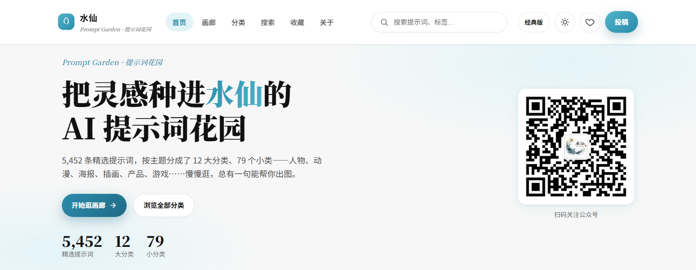 |  |

| Classic home | Click again to switch back to modern |
| --- | --- |
|  |  |

> **How the switch works**: it stays on the same kind of page when it can — home↔home, gallery↔gallery, favorites↔favorites — and falls back to the other skin's home page otherwise. Both skins use the site accent `#2B8AAB`, and each remembers its own light/dark preference.

## What's new in v1.0.2

> Compared with the previous build (v1.0.1, now archived at [Awesome-shuixian-prompts-archive](https://github.com/BaYue-SYJ/Awesome-shuixian-prompts-archive)): **13 new files, 11 new features, 6 fixes**.
> Current asset versions: modern `?v=12`, classic `?v=38`.
> Full technical write-up (implementation notes + maintenance scripts): [docs/FEATURES-2026-09-20.md](docs/FEATURES-2026-09-20.md)（中文）.

| Feature | What it does |
| --- | --- |
| **Variable filling** | 2,931 of the 5,430 prompts contain `{argument name="x" default="y"}` placeholders. A form fills them in, previews the result with the filled parts highlighted, and copies a **ready-to-use prompt** instead of a template. |
| **Facet tags** | Three cross-cutting tag families on top of the 79 categories — **medium** (poster / infographic / illustration / photography / 3D / UI / logo / typography / packaging / storyboard / card / cover), **style** (minimal / cyberpunk / retro / Chinese / Japanese / cinematic / editorial / hand-drawn / pixel / constructivist / glitch / steampunk / gothic / cute / realistic / fantasy) and **tone** (B&W / saturated / desaturated / warm / cool / black-gold / pink-purple / green). Live counts, multi-select (OR within a family, AND across families). |
| **Smart search** | Fuzzy matching (`海报设计` also hits 「设计感海报」), **pinyin initials** (`sbpk` → 赛博朋克, backed by a 1,683-character table), keyword highlighting in results, plus a relevance sort where title hits outrank body hits. |
| **Command palette** `Ctrl / ⌘ + K` | One box that searches commands, categories and prompts at once — jump to a page, random-walk, switch theme, switch language, export collections, or open a specific prompt with Enter. |
| **Collections** | Multi-collection manager with drag-and-drop ordering, move-between-collections, export to **Markdown / JSON / CSV** (BOM included so Excel opens it cleanly), copy-all, and re-import of your own JSON. Everything stays in your browser. |
| **Filters & lightbox extras** | Only-with-image / only-with-note / favourites-only / used-only filters; image download (fetch → blob); per-item notes saved as you type; a used-counter; `#id=` deep links that open the lightbox directly; context-aware ‹ › paging; LQIP blur-up loading. |
| **True bilingual UI** | One click on `EN / 中` translates the whole site — chrome, buttons, empty states, filters, collection manager, command palette, shortcut help and **all 87 category names** (261 UI strings). Prompt text and category params stay Chinese; the choice is remembered. |
| **PWA · shortcuts · mobile nav** | Installable to desktop with offline shell + lightweight data; `?` shows all shortcuts, `R` random-walks, a floating 🎲 button; the mobile header keeps only language / skin / theme plus a hamburger, everything else moves into the menu. |
| **Userscript** | `userscript/shuixian-prompt-garden.user.js` adds a Tampermonkey sidebar (`Ctrl+Shift+K`) on ChatGPT / Claude / Gemini / Midjourney / 即梦 / DeepSeek pages: search → fill variables → copy to clipboard. |
| **Classic skin parity** | The classic skin gets its own implementation of the command palette, smart search, variable filling, lightbox extras, random walk and shortcut help — and shares the same notes/usage localStorage keys as the modern skin. |

| Variable filling | Command palette | Bilingual UI |
| --- | --- | --- |
| 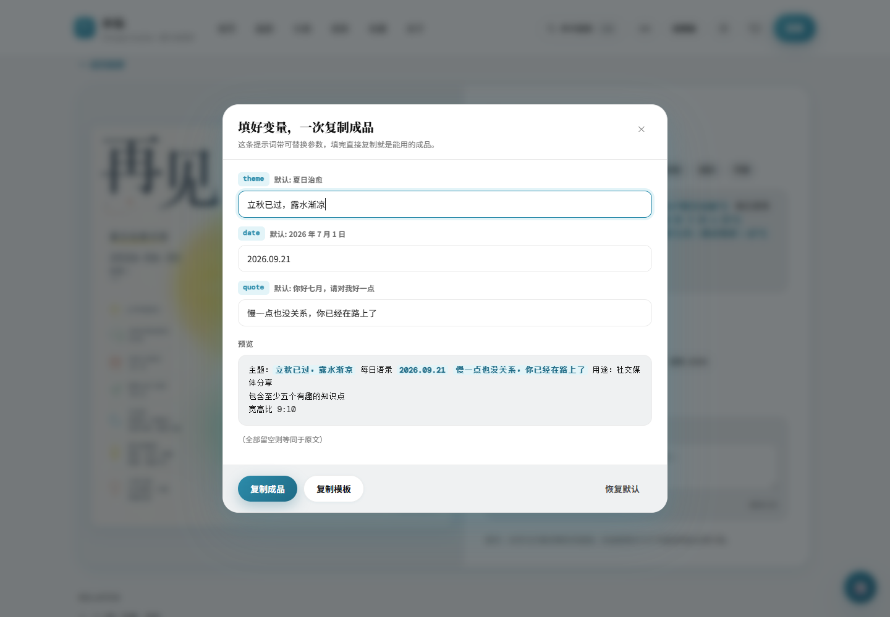 | 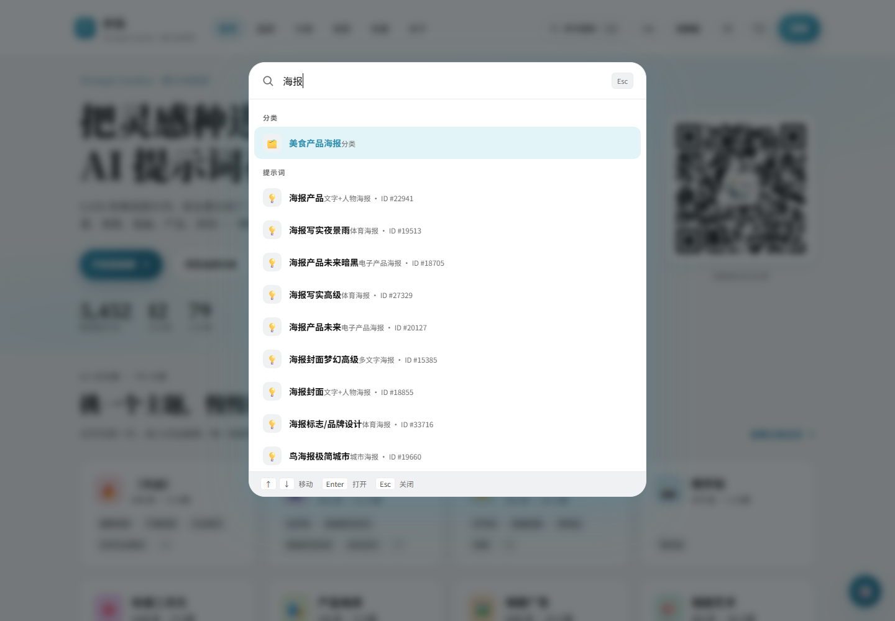 | 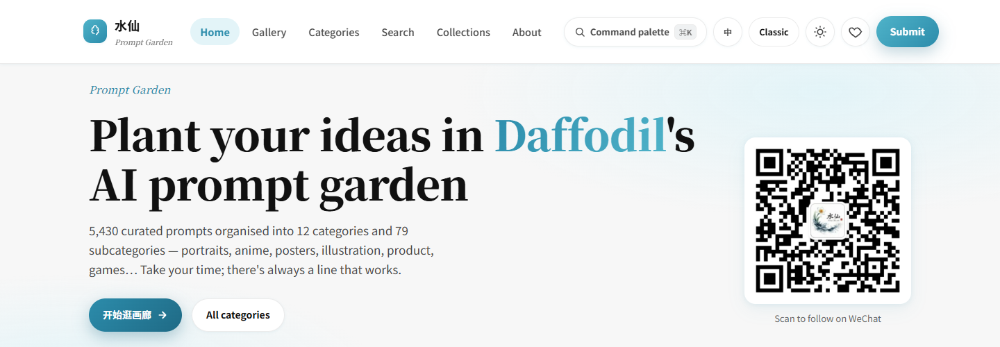 |

| Facet tags | Collections manager | Mobile header |
| --- | --- | --- |
| 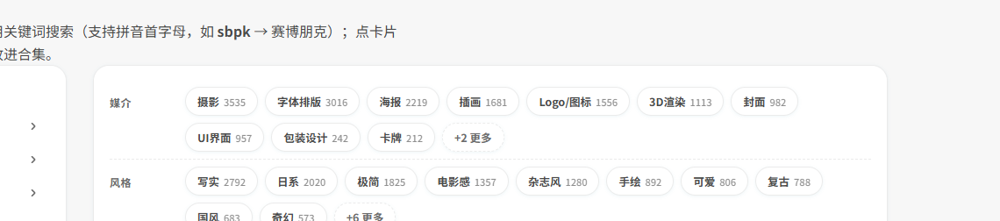 | 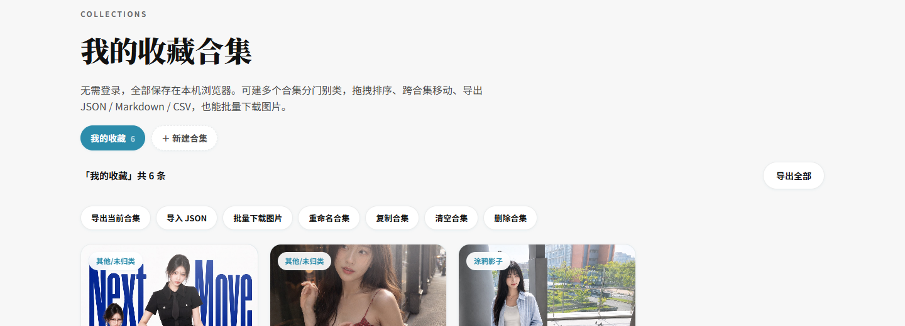 | 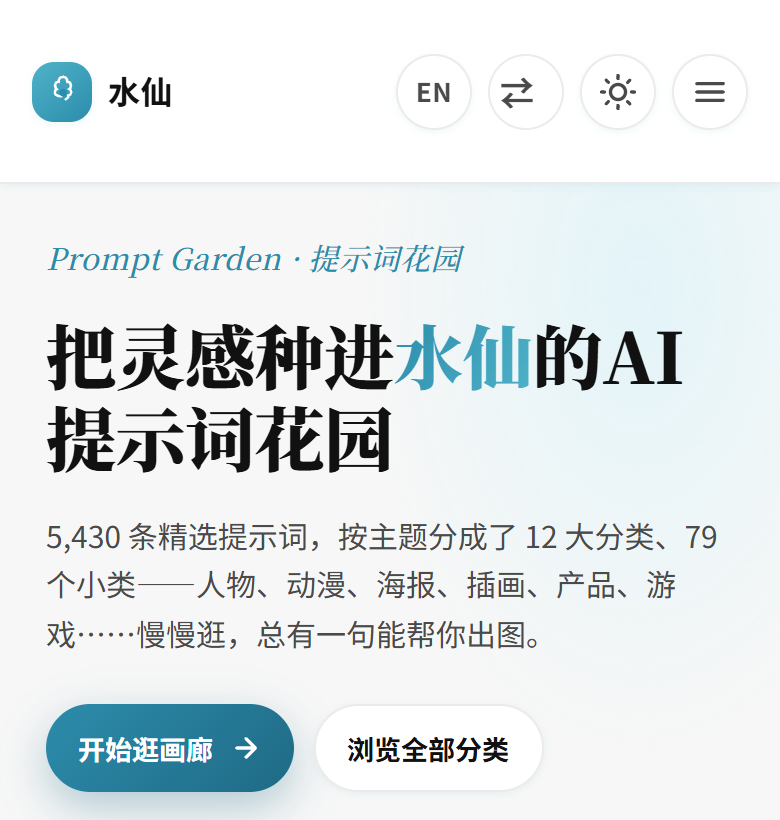 |

**Fixes in this release**: the classic command palette never opened (`const App` was never attached to `window`); Esc could not close it (`if (typing) return` ran before the Escape branch); every keystroke re-indexed all 5,430 prompts (25–61 ms → **0.1 ms** after caching + a 90 ms debounce); the modern lightbox clipped long prompts to a 32 px row (now full height, 0 px clipped); mobile menu items were centre-aligned with a missing language button; switching to English left a half-translated UI (now a full reload switch).

> Known data issue: ~233 prompts (4.3%) store variables with **escaped quotes** (`{argument name=\"x\"}`) which the current regex does not match, so their “fill variables” falls back to a plain copy. Fix by cleaning the data or loosening the regex.

## Older versions

> **This repository only keeps the latest release.** Older source trees are no longer stored in the file tree — they live in
> [**Awesome-shuixian-prompts-archive**](https://github.com/BaYue-SYJ/Awesome-shuixian-prompts-archive). Every tagged release can also be downloaded as
> Source code (zip) from [Releases](https://github.com/BaYue-SYJ/shuixian-prompts/releases).

| Version / directory | Prompts | Images | What it is | Where |
| --- | ---: | ---: | --- | --- |
| **`shuixian-unified/`** | 5,452 | 5,452 | **Current merged build v1.0.2**: 9 modern pages + 4 classic pages, one-click skin switch, shared dataset, variable filling / facets / bilingual UI / PWA | this repo |
| `shuixian-unified/` (v1.0.1) | 5,452 | 5,452 | Previous merged build — skin switching only | archive repo |
| `shuixian-deploy-modern/` | 5,452 | 5,452 | The modern skin before the merge | archive repo |
| `shuixian-deploy-classic/` | 5,452 | 7,386 | The classic skin before the merge (12 categories / 79 subcategories) | archive repo |
| `shuixian-deploy/` | 17,427 | 19,827 | An earlier live site with a Twitter-collected layer (3,948 entries) | archive repo |
| `shuixian-prompts/` | 17,427 | — | Local development copy of the 17,427-prompt dataset | archive repo |

> The first four share the same 5,452 prompts; the last two share the 17,427-prompt dataset.

### Preview of older versions

| classic | modern | earlier deploy build |
| --- | --- | --- |
| 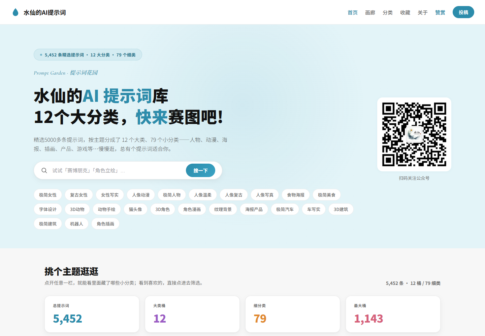 | 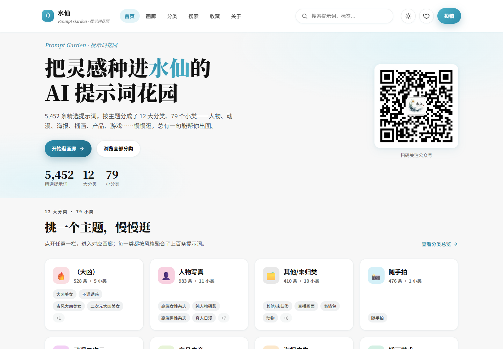 | 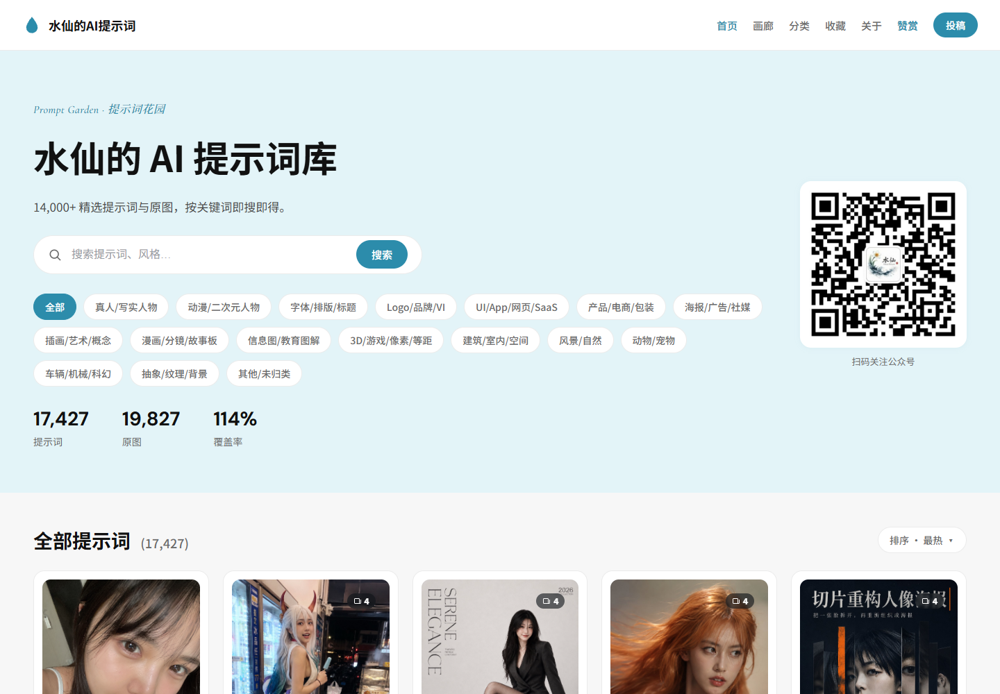 |
| 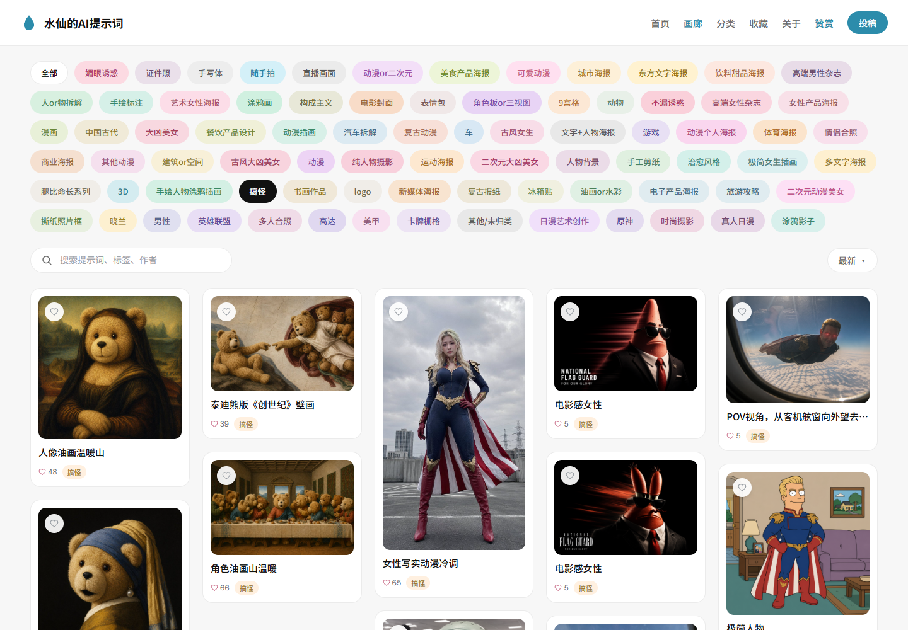 | 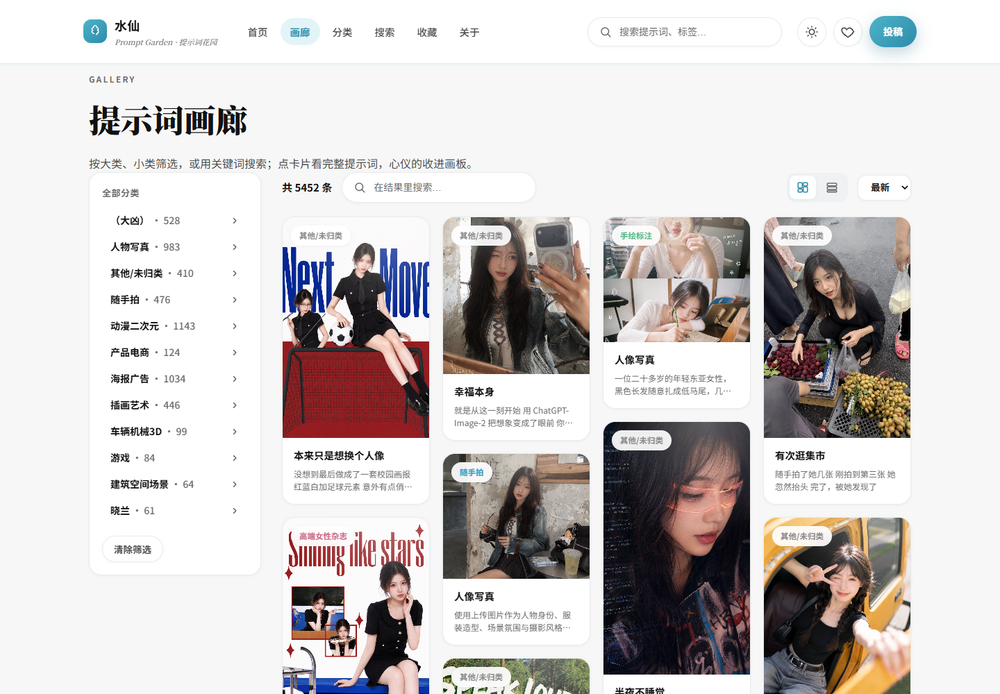 | 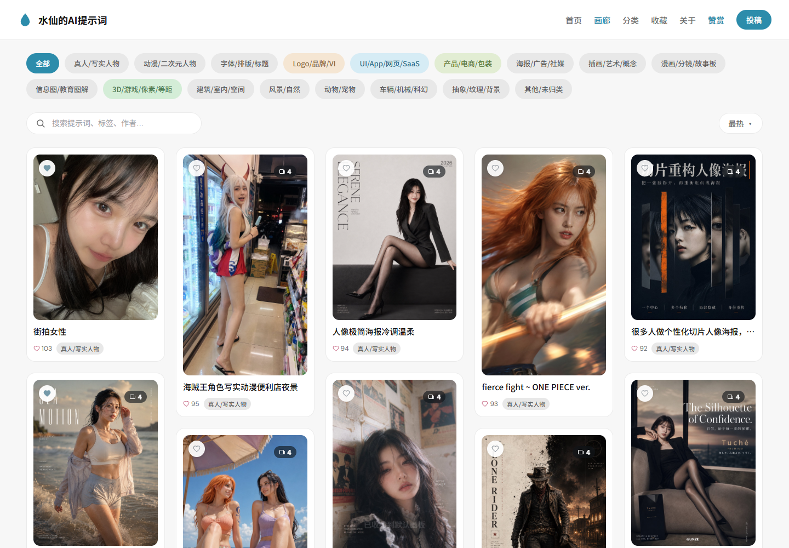 |
| 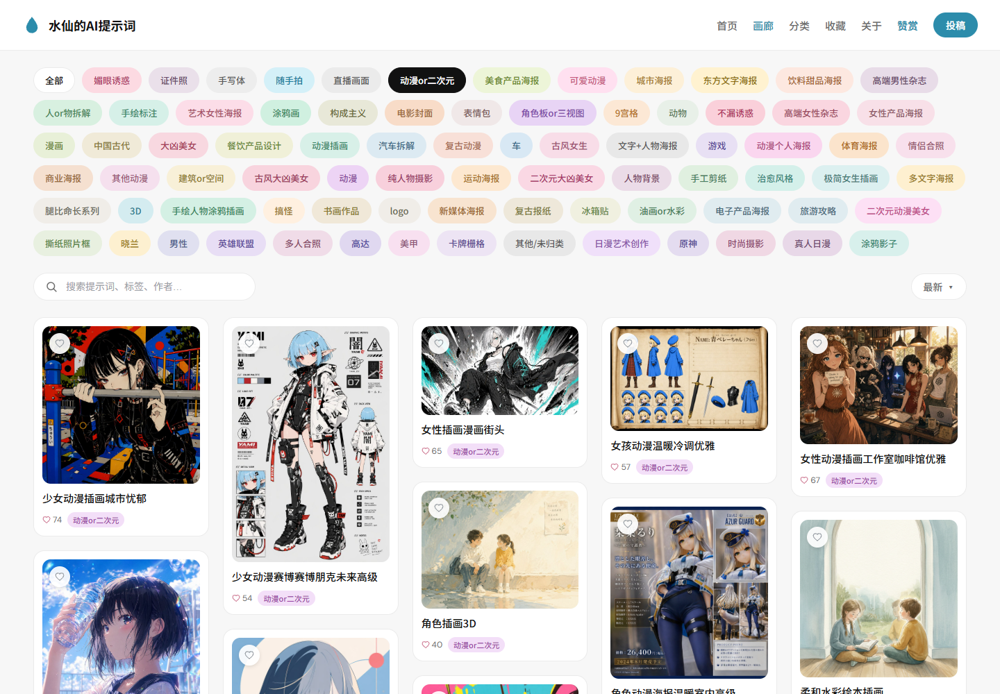 | 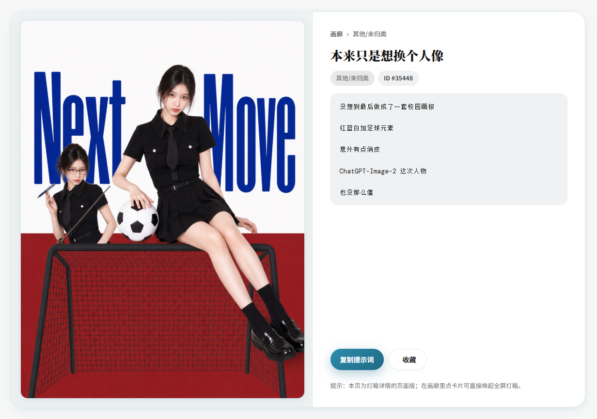 | 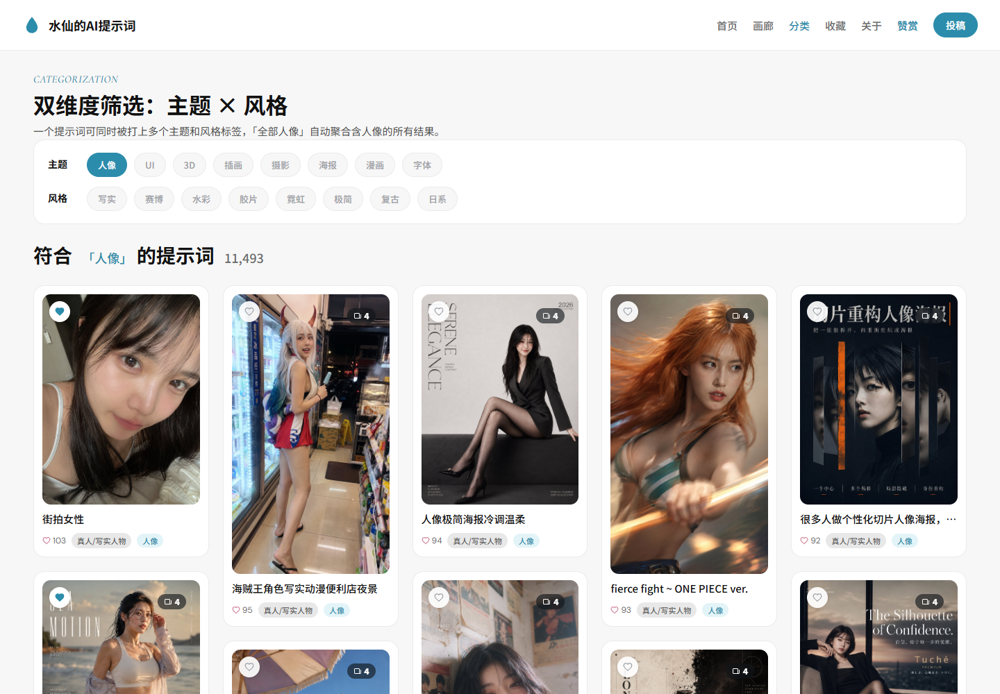 |

## Version comparison

## Repository layout

```
README.md  README.en.md  LICENSE
docs/
├── FEATURES-2026-09-20.md               Full write-up of the v1.0.2 features (Chinese)
└── screenshots/{unified,features,classic,modern,old}/
shuixian-unified/                        The current merged build, v1.0.2 (deployable on its own)
├── index.html  gallery.html  categories.html  detail.html  search.html
├── favorites.html  about.html  sponsor.html  submit.html  404.html
├── classic/                             Classic skin (subdirectory, shares the same data/)
│   ├── index.html  gallery.html  classify.html  favorites.html
│   ├── components/  css/  js/           incl. features-classic.js / features-classic.css
│   └── images/
├── components/  css/                    Modern skin (incl. features.css)
├── js/
│   ├── base.js                          Data loading, cards, lightbox, favourites
│   ├── features.js                      v1.0.2 feature module (auto-wires itself)
│   └── i18n.js                          Dictionary: 261 UI strings + 87 category names
├── data/                                Dataset (shared by both skins, incl. pinyin.json)
├── images/                              2 WeChat QR codes + app icon
├── tools/                               Maintenance scripts: pinyin table, version bump, i18n injection, regression tests
├── userscript/                          Tampermonkey sidebar script
├── sw.js  manifest.webmanifest          PWA (offline cache + installable)
└── _headers                             Cloudflare Pages caching + CORS for /data/*
```

> Older source trees are not kept in this repository (see "Older versions") — they are archived at
> [Awesome-shuixian-prompts-archive](https://github.com/BaYue-SYJ/Awesome-shuixian-prompts-archive). The file tree here holds the **latest** release only.

## Data

Each version ships its own `data/` folder and loads it in two layers: a lightweight list for the first paint, and the full records only when a detail view is opened or a prompt is copied.

| File | Content |
| --- | --- |
| `data/list.part1~3.json` | Lightweight list (title, category, likes, image path) — loaded on first paint |
| `data/prompts.part1~3.json` | Full records (including the `prompt` body) — loaded on demand |
| `data/categories.json` / `data/meta.json` | Category structure (the classic skin uses a flat map, the modern skin a major → subcategory tree) |
| `data/list-twitter.json` `data/prompts-twitter.json` | Twitter collection (only the `shuixian-deploy` copy in the archive repo carries data) |
| `data/twitter_manifest.json` | Lists the Twitter shard files |

Fields get leaner with each version:

| Version | Fields |
| --- | --- |
| earlier deploy build (archive repo) | `id` `title` `prompt` `image` `images` `category` `likes` `author` `slug` `resultsCount` `thumb` `tweet` |
| classic skin (`shuixian-unified/classic`; `shuixian-deploy-classic` in the archive repo) | Same as above, plus `themes` `styles` `person` |
| modern skin (`shuixian-unified`; `shuixian-deploy-modern` in the archive repo) | `id` `title` `prompt` `image` `category` `likes` |

## Image hosting: why images are not in git

The originals under `images/originals` (2.8 GB) and the Twitter images under `images/twitter` (5.7 GB) live in **Cloudflare R2** object storage. The site loads them from `https://r2.qqsrc.com` and needs no local files, so `images/originals/` and `images/twitter/` are excluded by `.gitignore`.

- Main library path: `images/originals/{id}.jpg`
- Twitter images: `images/twitter/{id}.jpg`
- The host lives in the `IMG_BASE` constant of each version's `js/base.js` — change it in one place to switch providers

Each version's `images/` folder holds only 2 WeChat QR codes, which the site itself uses.

## Local preview

Run one port per version to compare them side by side. All of them must be served over HTTP — opening the HTML files directly is blocked by `fetch`'s cross-origin rules:

```bash
python -m http.server 8094 --directory shuixian-unified
```

Open <http://localhost:8094/> for the merged build, then use the «经典版 / 现代版» button in the header to switch skins.

## Deployment and caching

Every version is a self-contained static folder — drag it into Cloudflare Pages, or any static host.
The caching rules in `_headers`:

- `css/` `js/` `components/` `images/` — long cache (1 year, immutable)
- `data/` — 1 hour (with `Access-Control-Allow-Origin: *` so the userscript and third-party tools can read it cross-origin)
- `*.html` — no cache, revalidated on every request
- `sw.js` — `no-cache`, otherwise Service Worker updates never ship

**After changing CSS / JS / components, bump the version in 4 places** (v1.0.2 onwards; JSON data carries no `?v=`):

1. `ASSET_VERSION` in `js/base.js`, the `?v=` in every HTML file, and both `VERSION` and the `?v=` entries in `sw.js`'s `PRECACHE`
   (current values: `shuixian-unified` modern = `12`, its `classic/` subdirectory = `38`)
2. Purge the cache after deploying, then hard-refresh locally with `Ctrl + Shift + R`

> **The classic skin versions independently**: `classic/js/base.js`'s `ASSET_VERSION` + the `?v=` in `classic/*.html` (no Service Worker).
> Helper scripts: `tools/bump_version.py` (modern) and `tools/bump_version_classic.py` (classic) update all spots at once.

> **Deploying the merged build**: drag the whole `shuixian-unified/` folder into Cloudflare Pages — it is self-contained,
> including the `classic/` subdirectory. If your Pages project was pointed at a subdirectory such as `shuixian-deploy-modern`
> before, update it to `shuixian-unified`.

## Related projects

| Project | Description |
|---|---|
| [**shuixian-manju-skills**](https://github.com/BaYue-SYJ/shuixian-manju-skills) | A six-piece drama toolkit: skills that take you from novel to finished short drama (inspired by shuohao-skills) |
| [**shuixian-threads-ai-radar**](https://github.com/BaYue-SYJ/threads-ai-radar) | Source code behind the Threads viral-content radar |
| [**zimeiti-workbuddy**](https://github.com/BaYue-SYJ/zimeiti-workbuddy) | Creator Buddy: an end-to-end Skill toolbox for WeChat, Xiaohongshu and short video |
| [**web-html-image-skill**](https://github.com/BaYue-SYJ/web-html-image-skill) | web-image: render images with HTML/CSS, no image model required, 32 preset styles |

---

## About the author

If this saved you some time, you can buy me a coffee ☕ — or just add me on WeChat to say hi.

| Tips | WeChat | Official Account |
|:---:|:---:|:---:|
|  |  |  |

## About the WeChat Official Account

I write about AI tools and prompts fairly regularly.
There is also a free public community group — add my WeChat: **Kas2026**.
Everything is free of charge; if you like tinkering, come and chat.

## Community

| [Linux.Do](https://linux.do) | Linux.Do /— share, discuss and follow along with the community. | Recognised by the LINUX DO community |
| --- | --- | --- |

---

[](https://star-history.com/#BaYue-SYJ/shuixian-prompts&Date)


> **License / attribution**: if you fork or reuse this project, please keep the credit and link back to [this repository](https://github.com/BaYue-SYJ/shuixian-prompts). Derivative projects must state where they came from. Commercial use requires prior permission. See [LICENSE](LICENSE) for details.
