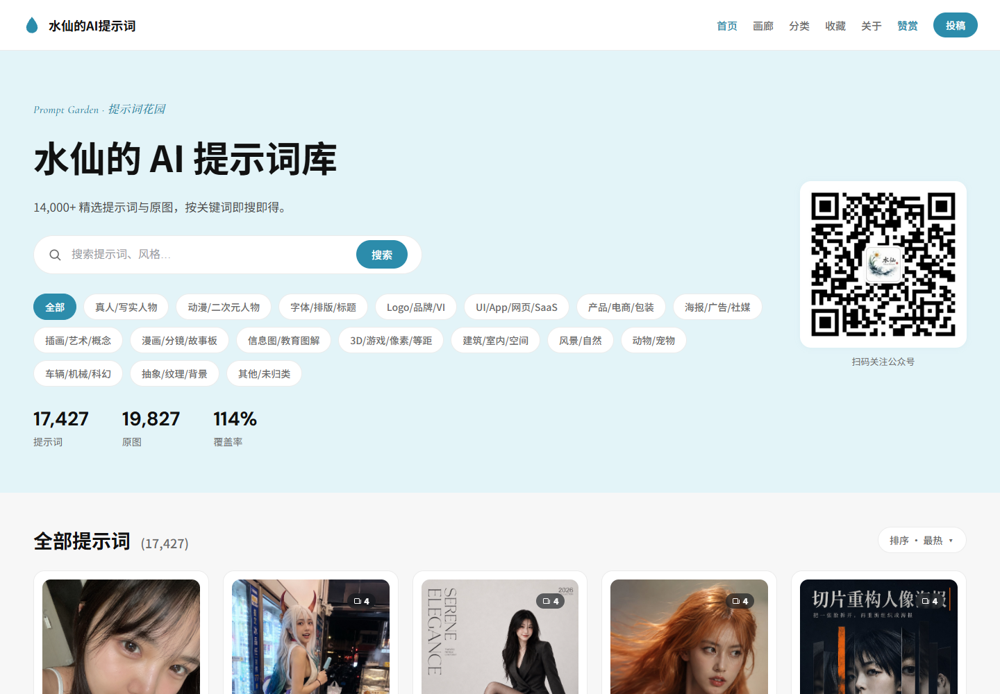
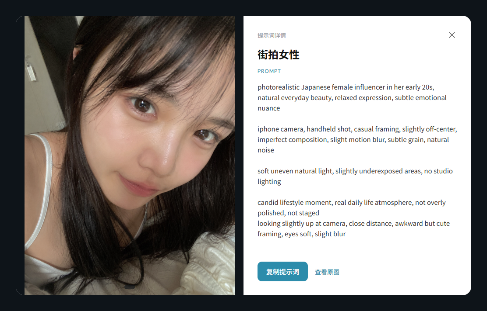
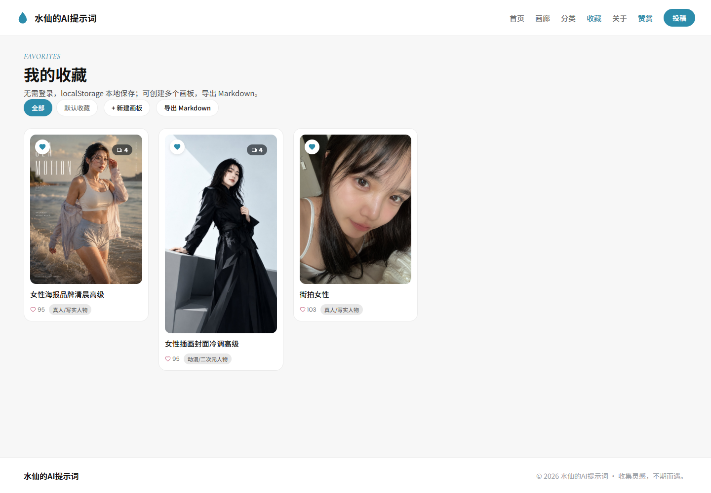
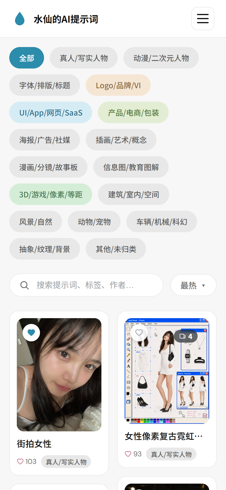

# 水仙的AI提示词

> 17,427 条精选 AI 提示词，配 19,827 张原图。按分类或关键词即搜即得，点开看大图，一键复制提示词。

**在线站点：** <https://prompt.qqsrc.com/> · 纯静态站点，无需登录 · 收藏数据保存在本地浏览器

## 界面预览

| 首页 | 画廊 |
| --- | --- |
|  |  |
| **提示词详情** | **分类筛选** |
|  |  |
| **收藏画板** | **移动端** |
|  |  |

## 功能

- **首页** —— 分类快捷入口、关键词即搜即得、「最热／最新」排序、瀑布流推荐、公众号二维码
- **画廊** —— 17 类分类筛选 + 关键词搜索 + 排序；卡片带点赞数、分类标签、多图角标；悬停即出「复制提示词／收藏／看大图」
- **分类** —— 「主题 × 风格」双维度标签，可叠加筛选；标签由标题与提示词正文的文本规则自动匹配，同一提示词可同时命中多个标签
- **收藏** —— 无需登录，`localStorage` 本地保存；支持多画板分组、导出 Markdown
- **提示词详情（灯箱）** —— 大图左右切换（键盘 `←` `→`、移动端滑动）、图片预加载、查看原图、一键复制提示词
- **响应式** —— 桌面 / 平板 / 移动三档断点，移动端折叠菜单

## 目录结构

```
shuixian-deploy/          部署版（静态托管，可直接上线）
├── index.html            首页
├── gallery.html          画廊
├── classify.html         分类（主题 × 风格）
├── favorites.html        收藏
├── components/           header / footer / lightbox / modals（由 JS 动态注入）
├── css/base.css          全站样式单一入口（含 17 类分类配色变量）
├── js/base.js            公共脚本：数据加载、卡片渲染、灯箱、收藏、Toast
├── js/{home,gallery,classify,favorites}.js   各页面逻辑
├── data/                 数据集（详见「数据」一节）
├── images/               2 张公众号二维码
└── _headers              Cloudflare Pages 缓存策略

shuixian-prompts/         本地开发版（完整数据 prompts.json，供本地检索与重分类）
```

## 数据

部署版数据分两层：**轻量列表**保证首屏速度，**完整数据**在打开详情或复制时才按需加载。

| 文件 | 条目 | 内容 |
| --- | --- | --- |
| `data/list.part1~3.json` | 13,479 | 主库轻量列表（标题、分类、点赞、图片路径），首屏加载约 3.2 MB |
| `data/prompts.part1~3.json` | 13,479 | 主库完整数据（含 `prompt` 正文），按需加载约 26 MB |
| `data/list-twitter.json` | 3,948 | Twitter 收录轻量列表 |
| `data/prompts-twitter.json` | 3,948 | Twitter 收录完整数据（含作者、多图），约 8.6 MB |
| `data/categories.json` | 17 类 | 分类统计（总数与占比） |
| `data/twitter_manifest.json` | — | 指定 Twitter 分片文件清单 |

**合计：17,427 条提示词 / 19,827 张原图**，其中 Twitter 收录 3,948 条、来自 435 位作者，平均每条 1.61 张图。

条目字段（完整数据）：

| 字段 | 说明 |
| --- | --- |
| `id` | 主键，灯箱与收藏都以它索引 |
| `title` | 标题 |
| `prompt` | 提示词正文（仅完整数据有） |
| `image` / `images` | 图片路径；主库条目为单图，Twitter 条目为多图数组 |
| `category` | 17 类分类之一 |
| `likes` | 点赞数，用于「最热」排序 |
| `author` | 作者（Twitter 收录） |
| `slug` / `resultsCount` / `thumb` | 来源站点的附加信息 |
| `tweet` | Twitter 推文 ID |

## 分类体系

17 类单标签，人物优先，非人物主题不串类：

| 分类 | 数量 | 占比 |
| --- | ---: | ---: |
| 真人/写实人物 | 14,042 | 80.6% |
| 动漫/二次元人物 | 2,723 | 15.6% |
| 其他/未归类 | 170 | 1.0% |
| 字体/排版/标题 | 85 | 0.5% |
| 抽象/纹理/背景 | 50 | 0.3% |
| 插画/艺术/概念 | 43 | 0.2% |
| 海报/广告/社媒 | 43 | 0.2% |
| 产品/电商/包装 | 42 | 0.2% |
| 风景/自然 | 37 | 0.2% |
| 3D/游戏/像素/等距 | 36 | 0.2% |
| 建筑/室内/空间 | 34 | 0.2% |
| 信息图/教育图解 | 29 | 0.2% |
| UI/App/网页/SaaS | 22 | 0.1% |
| 动物/宠物 | 22 | 0.1% |
| 车辆/机械/科幻 | 19 | 0.1% |
| Logo/品牌/VI | 18 | 0.1% |
| 漫画/分镜/故事板 | 12 | 0.1% |

> 分类既用于卡片配色 —— 17 类在 `css/base.css` 中各有一组配色变量；也用于画廊的筛选。
> 「主题 × 风格」是另一套独立的多标签筛选维度，两者互不影响。

## 图片托管：为什么不在 git 里

原图 `images/originals`（2.8 G）与 Twitter 图 `images/twitter`（5.7 G）都在 **R2 对象存储**，
站点通过 `https://r2.qqsrc.com` 加载，不依赖本地文件，因此 `shuixian-prompts/images/` 整体被 `.gitignore` 排除。

- 主库图片路径：`images/originals/{id}.jpg`
- Twitter 图片路径：`images/twitter/{id}.jpg`
- 图床地址是 `js/base.js` 里的 `IMG_BASE` 常量，改一处即可整体切换

仓库内的 `shuixian-deploy/images/` 只有 2 张公众号二维码，属于站点自身的静态资源。

## 本地预览

```bash
# 部署版（推荐，数据分层加载的完整形态）
python -m http.server 8091 --directory shuixian-deploy

# 本地开发版（完整 prompts.json，便于验证检索逻辑）
python -m http.server 8090 --directory shuixian-prompts
```

> 必须通过 HTTP 服务打开，直接双击 `index.html` 会因 `fetch` 的跨域限制加载不出数据。

## 部署与缓存

站点托管在 Cloudflare Pages，`_headers` 里约定了缓存策略：

- `css/` `js/` `components/` `images/` —— 长缓存（1 年，immutable）
- `data/` —— 1 小时
- `*.html` —— 不缓存，每次回源校验

**改 CSS / JS / 组件后必须同时做两件事**，否则边缘节点会继续返回旧文件：

1. 递增各 HTML 里的 `?v=` 与 `js/base.js` 里的 `ASSET_VERSION`（当前为 `6`）
2. 部署完成后 Purge Cache，本地用 `Ctrl + Shift + R` 硬刷新确认

## 社区

| [Linux.Do](https://linux.do) | Linux.Do /— 与社区分享、讨论和跟踪发展. | 认可 LINUX DO 社区 |
| --- | --- | --- |
