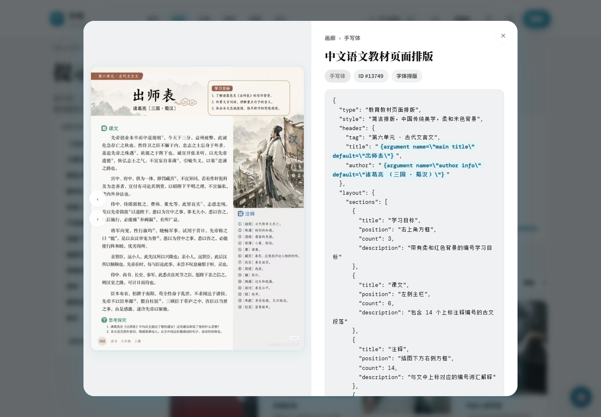
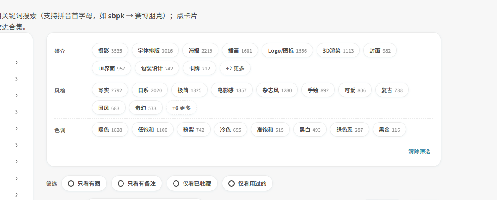
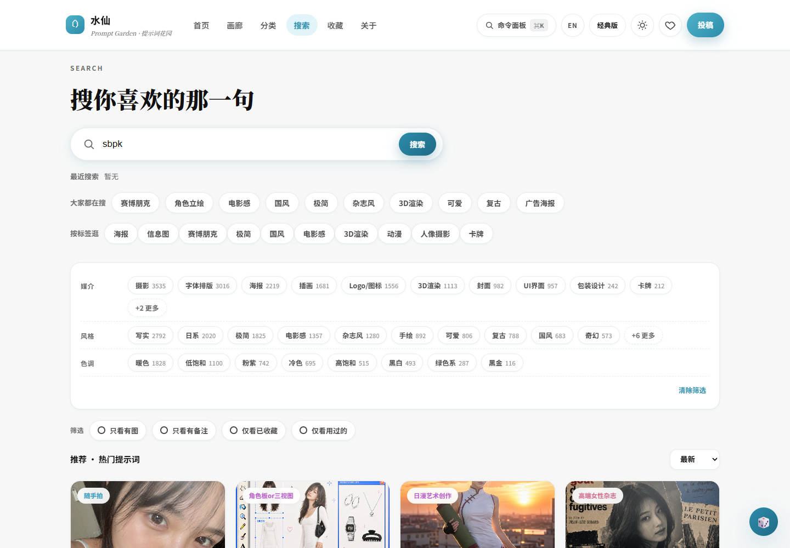
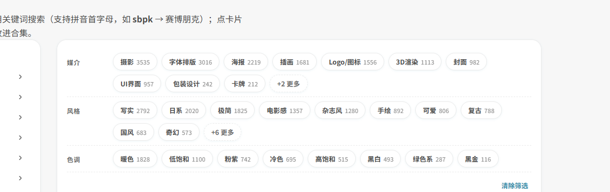
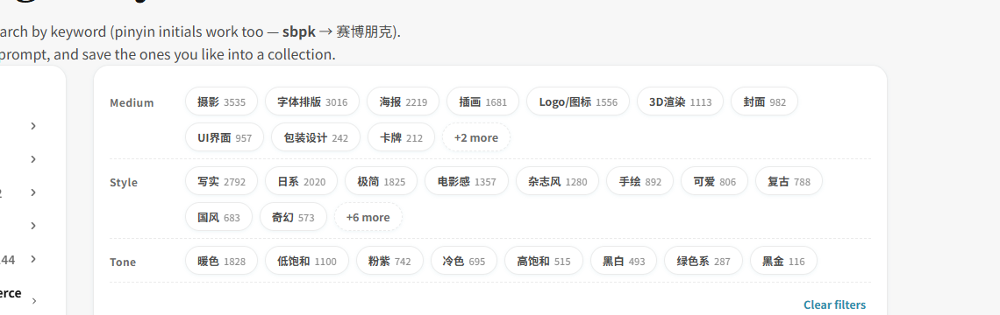
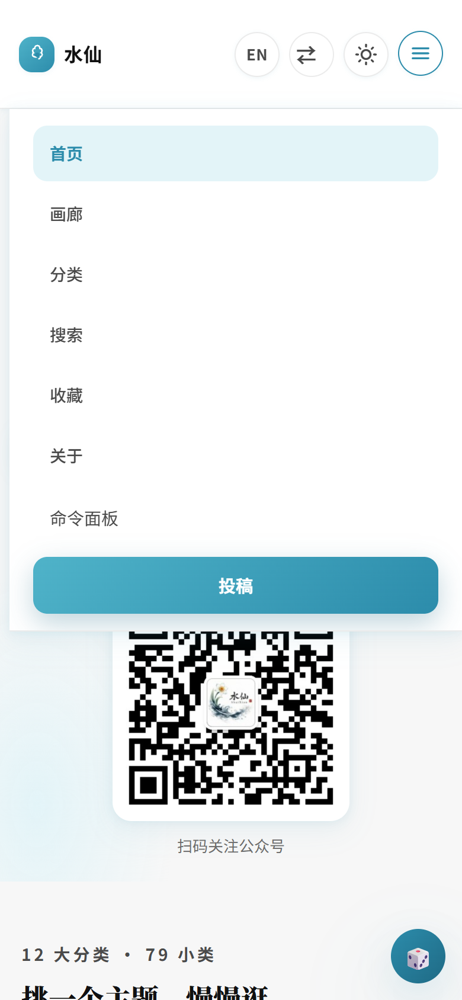
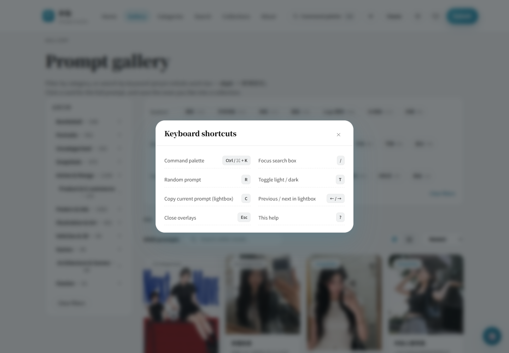
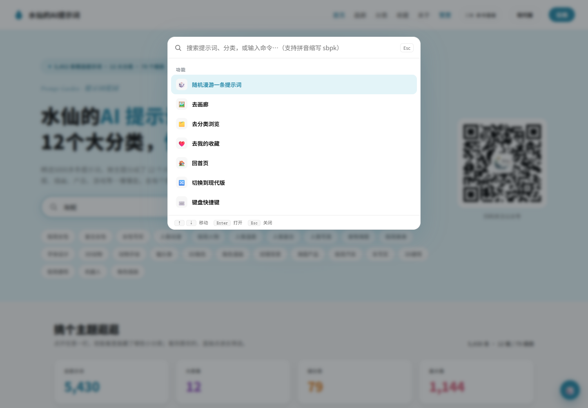
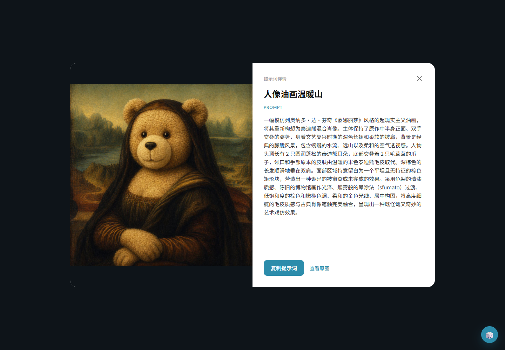

# 水仙的AI提示词

**简体中文** · [English](README.en.md)

> 合并版站点（现代 / 经典两套皮肤一键切换）+ 完整提示词数据集：按分类或关键词即搜即得，点开看大图，一键复制提示词。
> v1.0.2 起支持**变量填空、标签分面、拼音搜索、命令面板、收藏合集、中英双语、PWA 离线**。

**在线站点：** <https://prompt.qqsrc.com/> · 纯静态站点，无需登录 · 收藏数据保存在本地浏览器

**兼容模型：** ChatGPT· Grok · Gemini· Midjourney · Stable Diffusion · Flux · 即梦 · 可灵 · 豆包 · 海螺 · 文心一格等等

## 界面预览

### unified —— 现役版：两套皮肤一键切换

`shuixian-unified/` 把原先的两套皮肤合进了一个站点：**现代版**是页面级拆分（详情 / 搜索 / 分类 / 关于 / 投稿各自独立），**经典版**是「12 大类慢慢逛」的卡片墙。右上角一个按钮来回切，共用同一份数据。

| 现代版首页 | 点右上角切到经典版 |
| --- | --- |
|  |  |

| 经典版首页 | 点右上角切回现代版 |
| --- | --- |
|  |  |

> **切换规则**：会尽量停在同一类页面上 —— 首页↔首页、画廊↔画廊、收藏↔收藏；目标版本没有对应页面时回到该版首页。
> 两套皮肤的主题色都取自站点 `#2B8AAB`，深浅色主题也跟着各自记住。

## 本次更新 · v1.0.2

> 相对上一版（v1.0.1，现归档于 [archive 仓库](https://github.com/BaYue-SYJ/Awesome-shuixian-prompts-archive)）：**新增 13 个文件、11 项功能、3 处修复**。
> 现有版本号：现代版 `?v=12`、经典版 `?v=38`。
> 完整技术说明（含实现方式与维护脚本）见 [docs/FEATURES-2026-09-20.md](docs/FEATURES-2026-09-20.md)。

### 1. 变量填空 → 复制成品

数据里 5,430 条提示词有 **2,931 条带可替换参数**（`{argument name="x" default="y"}`）。现在点「✍️ 填变量并复制」会弹出表单：填好每个变量、实时预览里高亮显示填进去的部分，留空的回落到默认值，点「复制成品」拿到的是**能直接用的文本**，不再是一句带占位符的模板。同时保留「复制模板」。

| 变量表单（实时预览 + 高亮） | 灯箱里的入口 |
| --- | --- |
|  |  |

### 2. 标签分面：在 79 个分类之外再加一层

从每条提示词的标题 / 分类 / 正文自动提取三类**横切标签**：**媒介**（海报 / 信息图 / 插画 / 摄影 / 3D渲染 / UI界面 / Logo图标 / 字体排版 / 包装设计 / 漫画分镜 / 卡牌 / 封面）、**风格**（极简 / 赛博朋克 / 复古 / 国风 / 日系 / 电影感 / 杂志风 / 手绘 / 像素 / 构成主义 / 故障艺术 / 蒸汽朋克 / 哥特 / 可爱 / 写实 / 奇幻）、**色调**（黑白 / 高饱和 / 低饱和 / 暖色 / 冷色 / 黑金 / 粉紫 / 绿色系）。带实时计数、可多选（同类内取或、跨类取与）。

| 分面栏（带计数） | 选中后实时过滤 |
| --- | --- |
|  |  |

### 3. 智能搜索

- **模糊匹配**：不要求连续，`海报设计` 能命中「设计感海报」
- **拼音首字母**：输入 `sbpk` 就出「赛博朋克」（基于 1,683 字的拼音表，两套皮肤共用）
- **关键词高亮**：结果里命中的词用 `<mark>` 标出（已做 HTML 转义）
- **相关度排序**：排序多一个「相关度」，标题命中优先于正文命中



### 4. 命令面板 `Ctrl / ⌘ + K`

一个输入框同时搜「功能 + 分类 + 提示词」：可直接跳页、随机漫游、切主题、切语言、导出合集；也能搜到某条提示词并按回车打开。↑↓ 移动、Enter 打开、Esc 关闭。


### 5. 收藏合集（收藏页重写为管理器）

多合集（新建 / 重命名 / 复制 / 删除 / 清空）、**拖拽排序**（合集标签与合集内卡片都可拖）、**跨合集移动**、**导出 Markdown / JSON / CSV**（带 BOM，Excel 直接打开不乱码）、一键复制全部提示词、**导入自己的 JSON**（以 `imp-` 前缀另存，不污染原库）。合集、备注、使用次数都只存在本机浏览器。


### 6. 筛选项与灯箱增强

- 画廊 / 搜索页工具栏：**只看有图 / 只看有备注 / 仅看已收藏 / 仅看用过的**
- 灯箱与卡片：**下载图片**（fetch→blob，文件名自动用标题+ID）、**备注**（边打边存，卡片右上角黄点标记）、**标记已用**（累加使用次数）、**复制链接**（`#id=` 深链，打开即自动弹出该条）、**‹ › 翻页**（按当前筛选上下文翻，不是全库乱跳）、**LQIP 加载**（先模糊后清晰）

| 筛选项 | 灯箱（备注 / 使用次数 / 动作条） |
| --- | --- |
|  |  |

### 7. 真正的英文版（顶栏 `EN / 中`）

点一下**整站换语言**：导航、页头、按钮、空状态、筛选器、合集管理、命令面板、快捷键帮助，以及 **87 个分类名**（`人物写真 → Portraits`、`9宫格 → 9-Grid`、`构成主义 → Constructivism`…）全部翻译，选择会被记住。提示词正文与分类参数保持中文（那是内容本身）。共 **261 组 UI 文案 + 87 个分类名**。

| 英文版首页 | 英文版画廊（分面与筛选也翻译） |
| --- | --- |
|  |  |

### 8. PWA · 快捷键 · 手机端

- **PWA**：带 `manifest.webmanifest` + Service Worker，可「安装到桌面」，离线能浏览外壳与轻量数据
- **快捷键**：按 `?` 看全部；`R` 随机漫游；右下角常驻 🎲 浮球
- **手机端导航改版**：顶栏只留 **语言 / 切换版本 / 主题** 三个按钮 + 汉堡菜单，其余（命令面板、投稿等）全部收进菜单；≤1000px 自动切换为汉堡模式，菜单项左对齐、可滚动、点了自动收起

| 手机端顶栏（三键 + 汉堡） | 展开的菜单 |
| --- | --- |
|  |  |



### 9. 油猴侧边栏脚本

`userscript/shuixian-prompt-garden.user.js`：装到 Tampermonkey 后，在 ChatGPT / Claude / Gemini / Midjourney / 即梦 / DeepSeek 页面按 `Ctrl+Shift+K` 召唤侧边栏，搜索 →（有变量则填表单）→ 一键复制到剪贴板。
**用前把脚本顶部的 `SITE` 改成你的线上地址。** 站点 `_headers` 已为 `/data/*` 打开 CORS，这是脚本能跨域读数据的前提。

### 10. 经典版同步增强

经典版有自己一套 `base.js`，新功能是独立实现的：**命令面板 `⌘K`**、**智能搜索（模糊 + 拼音 + 高亮）**、**变量填空复制**、**灯箱增强**（备注 / 使用次数 / 标记已用 / 下载 / 复制 Markdown / 命中标签）、**随机漫游**、**快捷键帮助**、**LQIP**。备注与使用次数和现代版**共用同一份 localStorage**，两版互通。

| 经典版命令面板 | 经典版灯箱增强 |
| --- | --- |
|  |  |

### 附：本轮修复

| 问题 | 根因 | 结果 |
| --- | --- | --- |
| 经典版命令面板「点了没反应」 | `classic/js/base.js` 的 `const App` 没挂到 `window`，features 模块的启动判断永远为假 | 补 `window.App = App`，面板正常弹出 |
| 经典版面板 Esc 关不掉 | 按键处理里 `if (typing) return` 排在 Esc 之前，而焦点正在输入框 | Esc 分支提前，统一关闭遮罩 |
| 经典版每键卡顿 | 每次按键对 5,430 条全量重算小写/拼音/标签（25~61ms） | WeakMap 索引缓存 + 90ms 防抖，**单键 0.1ms**（降 250~600 倍） |
| 现代版灯箱提示词只显示一行 | `.lb-body` 为 flex 列容器，`.lb-prompt` 被 `flex-shrink` 压到 32px（内容 1,755px） | 整段自然铺开，**截断 0px**；桌面端 grid 行高同步修正 |
| 手机端菜单项全居中、语言按钮消失 | `.nav-links` 的 `align-items:center` 在纵向布局下变成水平居中；语言按钮被 1040px 断点隐藏 | 移动端 `align-items:stretch` + 语言按钮强制显示 |
| 切英文后「半中半英」 | 就地替换文案必然漏掉动态生成的按钮与卡片 | 改为整站重载切换，100% 一致 |

> ⚠️ 已知数据问题：约 **233 条（4.3%）**提示词的变量写作**转义引号**形式（`{argument name=\"x\"}`），当前正则只识别标准形式 `{argument name="x"}`，这批条目的「填变量」会退化为直接复制。修复方式二选一：清洗数据，或让正则同时兼容 `\"`。

## 历史版本

> **本仓库只保留最新版本的代码。** 旧版本的源码不再堆在文件树里，全部归档到
> [**Awesome-shuixian-prompts-archive**](https://github.com/BaYue-SYJ/Awesome-shuixian-prompts-archive)；
> 每个发布版本的完整快照也可以从 [Releases](https://github.com/BaYue-SYJ/shuixian-prompts/releases) 直接下载 Source code (zip)。

| 版本 / 目录 | 提示词 | 图片 | 定位 | 去哪找 |
| --- | ---: | ---: | --- | --- |
| **`shuixian-unified/`** | 5,452 | 5,452 | **现役合并版 v1.0.2**：现代版 9 页 + 经典版 4 页（`classic/` 子目录），一键切换皮肤，共用一份数据；含变量填空 / 分面 / 双语 / PWA | 就在本仓库 |
| `shuixian-unified/`（v1.0.1） | 5,452 | 5,452 | 上一版合并版：只有皮肤切换，无 v1.0.2 的新功能 | archive 仓库 |
| `shuixian-deploy-modern/` | 5,452 | 5,452 | 合并前的现代版（页面级拆分） | archive 仓库 |
| `shuixian-deploy-classic/` | 5,452 | 7,386 | 合并前的经典版（12 大类 / 79 细类） | archive 仓库 |
| `shuixian-deploy/` | 17,427 | 19,827 | 更早一版线上站点，多一层 Twitter 收录（3,948 条），编辑式画廊皮肤 | archive 仓库 |
| `shuixian-prompts/` | 17,427 | — | 同一套数据的本地开发版，图片不入库（见「图片托管」） | archive 仓库 |

> 前四个目录用的是同一套 5,452 条提示词，差别在信息架构、皮肤与功能；
> 后两个目录共用 17,427 条那套数据，差别在「是否含图片目录、是否作为部署包」。

### 历史版本界面预览

| classic（12 大类 / 79 细类） | modern（页面级拆分） | 更早的 deploy 版（含 Twitter 收录） |
| --- | --- | --- |
|  |  |  |
|  |  |  |
|  |  |  |

## 仓库结构

```
README.md
LICENSE
docs/
├── FEATURES-2026-09-20.md               v1.0.2 新增功能的完整技术说明
└── screenshots/
    ├── unified/                         合并版皮肤切换（4 张）
    ├── features/                         v1.0.2 新功能（17 张）
    └── classic/  modern/  old/           历史版本界面
shuixian-unified/                        现役合并版 v1.0.2（可独立部署）
├── index.html  gallery.html  categories.html  detail.html  search.html
├── favorites.html  about.html  sponsor.html  submit.html  404.html
├── classic/                             经典版皮肤（子目录，与主站共用同一份 data/）
│   ├── index.html  gallery.html  classify.html  favorites.html
│   ├── components/  css/  js/           含 features-classic.js / features-classic.css
│   └── images/
├── components/  css/                    现代版皮肤（含 features.css）
├── js/
│   ├── base.js                          数据加载、卡片、灯箱、收藏
│   ├── features.js                      v1.0.2 新功能核心模块（自动装配）
│   └── i18n.js                          文案字典：261 组 UI 文案 + 87 个分类名
├── data/                                数据集（两套皮肤共用，含 pinyin.json）
├── images/                              2 张公众号二维码 + 应用图标
├── tools/                               维护脚本：拼音表 / 版本号 / i18n 注入 / 回归测试
├── userscript/                          油猴侧边栏脚本
├── sw.js  manifest.webmanifest          PWA（离线缓存 + 可安装到桌面）
└── _headers                             Cloudflare Pages 缓存策略 + /data/* CORS
```

> 历史版本的源码不在本仓库（见「历史版本」一节），归档在
> [Awesome-shuixian-prompts-archive](https://github.com/BaYue-SYJ/Awesome-shuixian-prompts-archive)。
> 本仓库的文件树只保留**最新版本**。

## 数据

每个版本各自带一份 `data/`，都采用**分层加载**：轻量列表负责首屏，完整数据在打开详情或复制时才按需加载。

| 文件 | 内容 |
| --- | --- |
| `data/list.part1~3.json` | 轻量列表（标题、分类、点赞、图片路径），首屏加载 |
| `data/prompts.part1~3.json` | 完整数据（含 `prompt` 正文），按需加载 |
| `data/categories.json` / `data/meta.json` | 分类结构（经典版用扁平映射，现代版用大类 → 小类树） |
| `data/list-twitter.json` `data/prompts-twitter.json` | Twitter 收录（仅 archive 仓库里的 `shuixian-deploy` 有数据） |
| `data/twitter_manifest.json` | 指定 Twitter 分片文件清单 |

字段随版本递进变精简：

| 版本 | 字段 |
| --- | --- |
| 更早的 deploy 版（archive 仓库） | `id` `title` `prompt` `image` `images` `category` `likes` `author` `slug` `resultsCount` `thumb` `tweet` |
| 经典版（`shuixian-unified/classic`；archive 仓库的 `shuixian-deploy-classic`） | 同上，另带 `themes` `styles` `person` |
| 现代版（`shuixian-unified`；archive 仓库的 `shuixian-deploy-modern`） | `id` `title` `prompt` `image` `category` `likes` |

## 图片托管：为什么不在 git 里

原图 `images/originals`（2.8 G）与 Twitter 图 `images/twitter`（5.7 G）都在 **R2 对象存储**，
站点通过 `https://r2.qqsrc.com` 加载，不依赖本地文件，因此 `images/originals/` 与 `images/twitter/` 整体被 `.gitignore` 排除。

- 主库图片路径：`images/originals/{id}.jpg`
- Twitter 图片路径：`images/twitter/{id}.jpg`
- 图床地址是各版本 `js/base.js` 里的 `IMG_BASE` 常量，改一处即可整体切换

各版本 `images/` 目录里只有 2 张公众号二维码，属于站点自身的静态资源。

## 本地预览

各版本起一个端口即可对照（都必须走 HTTP，直接双击 HTML 会被 `fetch` 的跨域限制挡住）：

```bash
python -m http.server 8094 --directory shuixian-unified
```

打开 <http://localhost:8094/> 就是合并版；点右上角「经典版 / 现代版」按钮切换皮肤。

## 部署与缓存

每个版本都是自包含的静态目录，可直接拖拽到 Cloudflare Pages 或任意静态空间。
`_headers` 里约定的缓存策略：

- `css/` `js/` `components/` `images/` —— 长缓存（1 年，immutable）
- `data/` —— 1 小时（已加 `Access-Control-Allow-Origin: *`，供油猴脚本与第三方工具跨域读数据）
- `*.html` —— 不缓存，每次回源校验
- `sw.js` —— `no-cache`，否则 Service Worker 更新发不出去

**改 CSS / JS / 组件后要同步升版本号，v1.0.2 起共 4 处**（不含 JSON 数据，数据不带 `?v=`）：

1. `js/base.js` 的 `ASSET_VERSION`、各 HTML 的 `?v=`、`sw.js` 的 `VERSION` 与 `PRECACHE` 里的 `?v=`
   （当前值：`shuixian-unified` 现代版 = `12`、其 `classic/` 子目录 = `38`）
2. 部署完成后 Purge Cache，本地用 `Ctrl + Shift + R` 硬刷新确认

> **经典版独立计版本**：`classic/js/base.js` 的 `ASSET_VERSION` + `classic/*.html` 的 `?v=`（无 SW）。
> 维护脚本：`tools/bump_version.py`（现代版）、`tools/bump_version_classic.py`（经典版）可一次改完多处。

> **部署合并版**：把 `shuixian-unified/` 整个目录拖进 Cloudflare Pages 即可（它是自包含的，`classic/` 子目录一起带走）。
> 如果 CF Pages 之前是按子目录（如 `shuixian-deploy-modern`）配置的，记得改成 `shuixian-unified`。

   
## 相关项目

| 项目 | 说明 |
|---|---|
| [**shuixian-manju-skills**](https://github.com/BaYue-SYJ/shuixian-manju-skills) | 水仙的漫剧 6 件套：从小说到短剧成片的创作技能集（灵感来源于 shuohao-skills） |
| [**shuixian-threads-ai-radar**](https://github.com/BaYue-SYJ/threads-ai-radar) | 水仙的threads 爆款搜集源码 |
| [**zimeiti-workbuddy**](https://github.com/BaYue-SYJ/zimeiti-workbuddy) | Creator Buddy：公众号 / 小红书 / 短视频的全流程创作 Skill 工具箱 |
| [**web-html-image-skill**](https://github.com/BaYue-SYJ/web-html-image-skill) | web-image：用 HTML/CSS 渲染出图，不依赖生图模型，32 套预设风格 |

---


## 关于作者

如果这个东西帮你省了时间，可以请我喝杯咖啡 ☕；想直接聊也欢迎加微信。

| 赞赏码 | 微信 | 公众号 |
|:---:|:---:|:---:|
|  |  |  |
## 关于公众号
会经常写一些 AI 工具与提示词相关的东西。
如果需要加入公益免费交流群，可以加我VX:Kas2026  
做的都是公益的不收取任何费用，喜欢技术的可以一起交流。

## 社区

| [Linux.Do](https://linux.do) | Linux.Do /— 与社区分享、讨论和跟踪发展. | 认可 LINUX DO 社区 |
| --- | --- | --- |

---
[](https://star-history.com/#BaYue-SYJ/shuixian-prompts&Date)


> **项目授权要求**：fork 或使用请保留出处并链接回 [本仓库](https://github.com/BaYue-SYJ/shuixian-prompts)，衍生项目需写清来源；商用需先获授权。详见 [LICENSE](LICENSE)。


